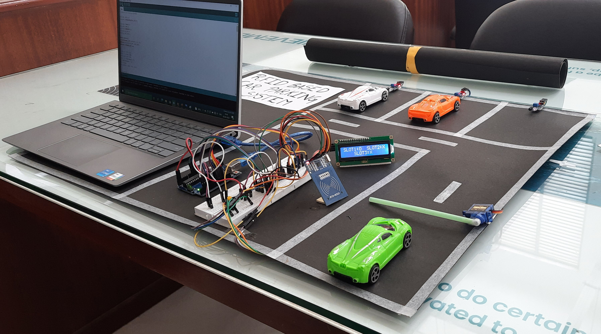

# Rfid-Based-Car-Parking-System

 A car parking system arduino project which makes use of rfid tags to identify cars 

 Servo motor is used to mimic gates 

 IR sensors are used to sense a car parked at a slot 

 LCD screen is used display the available slots 

 User is charged based on the amount of time car is parked 

 User can view balance in the LCD screeen and recharge using button click 

 Data regarding balance, arrival and departure time is maintained in rfid tag 

